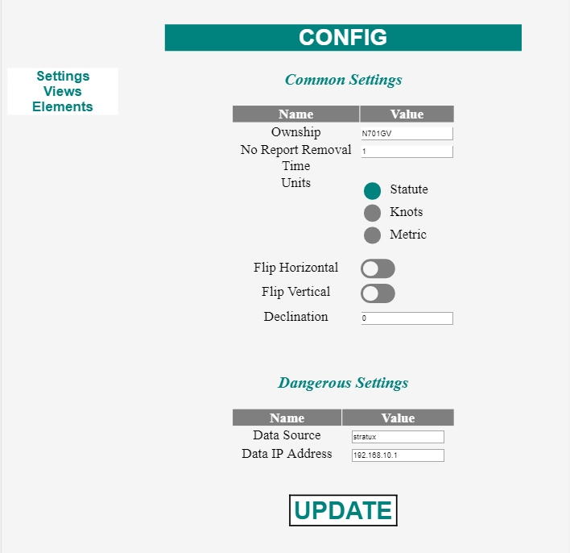

# STRATUX HUD CONFIG

## Introduction

This project aims to bring an easy way to configure and control a StratuxHud. It also aims to make the setup process easier.

__NOTE:__ This project relies on having a [Stratux](http://stratux.me/) build with AHRS and GPS. A suitable build can be done for less than $150 (USD).

__NOTE:__ This project relies on having a [StratuxHud](https://github.com/JohnMarzulli/StratuxHud)

## Using

To use, once your StratuxHud is up and running, navigate to the System Diagnostics page. Note the IP address.

Navigate (using your phone, tablet, or other browser) to `http://<ip>:3000`



## Pages

There are three main views:

- [Settings](#Settings)
- <Views>
- <Elements>

### Settings

This provides a simple interface to the configuration of the StratuxHud

#### Data Source

The type of source the HUD should use. This should be left to `stratux` 99% of the time. Setting to `simulation` will ignore the ADS-B receiver and run it in a "demo mode".

#### Data IP Address

This is the address of the ADS-B receiver that the HUD will draw data from. This should be `192.168.10.1` 99% of the time.

#### No Report Removal Time

This is the number of minutes after a __not__ receiving a report that traffic is removed from the view.

#### Units

Selects which units the data will be shown in.

Choices are:

- statute
- knots
- metric

#### Flip Horizontal

Should the image be flipped left to right?

Default is `false`.

#### Flip Vertical

Should the image be flipped top to bottom?

Default is `false`

Set to `true` if you are using a "Teleprompter Glass" build.

#### Declination

The adjustment of the compass based on magnetic variance.

Set to `0` to leave in "true". Set to your local value for `magnetic` readings.

#### Update

Click or tap this button to send the new configuration to the HUD.

### Views

This allows you to customize the views available in the HUD.

Before editing these settings, please take some time to become familiar with the JSON file format.

The `elements` section allows you to add or remove elements within a view. The `name` field is the "friendly" name of the view and is displayed the upper left hand corner of the HUD.

Views will be shown in the order they are listed. The first view will be the default view at boot.

__NOTE:__ The element names need to match the names listed on the "Elements" page. Capitalization and spelling matter.

You may modify the text and then click or tap the `UPDATE` button.

```json
[
    {
        "elements": [
            "Compass",
            "ADSB Target Bugs",
            "ADSB Reticles"
        ],
        "name": "Traffic"
    },
    {
        "elements": [
            "Traffic List"
        ],
        "name": "Traffic List"
    },
    {
        "elements": [
            "Level Reference",
            "Artificial Horizon",
            "Compass",
            "Altitude",
            "G Load",
            "Roll Indicator",
            "Groundspeed"
        ],
        "name": "AHRS"
    },
    {
        "elements": [
            "Time"
        ],
        "name": "Universal Time"
    },
    {
        "elements": [
            "System Info"
        ],
        "name": "Diagnostics"
    },
    {
        "elements": [],
        "name": ""
    }
]
```

### Elements

This is a _read only_ view that gives you the names of the elements available to make a view.

This view reveals some of the internal nature of the code and its organization.

Example of element names are:

- `G Load`
- `ADSB Target Bugs`
- `System Info`

__NOTE:__ Capitalization and spelling matter when using these to modify the [Views](#Views) configuration.

```json
{
    "G Load": {
        "detail_font": true,
        "class": "skid_and_gs.SkidAndGs"
    },
    "ADSB Target Bugs": {
        "detail_font": false,
        "class": "adsb_target_bugs.AdsbTargetBugs"
    },
    "System Info": {
        "detail_font": false,
        "class": "system_info.SystemInfo"
    },
    "Roll Indicator": {
        "detail_font": true,
        "class": "roll_indicator.RollIndicator"
    },
    "Groundspeed": {
        "detail_font": true,
        "class": "groundspeed.Groundspeed"
    },
    "Altitude": {
        "detail_font": true,
        "class": "altitude.Altitude"
    },
    "Compass": {
        "detail_font": true,
        "class": "compass_and_heading_bottom_element.CompassAndHeadingBottomElement"
    },
    "Traffic List": {
        "detail_font": true,
        "class": "adsb_traffic_listing.AdsbTrafficListing"
    },
    "ADSB Reticles": {
        "detail_font": false,
        "class": "adsb_on_screen_reticles.AdsbOnScreenReticles"
    },
    "Artificial Horizon": {
        "detail_font": true,
        "class": "artificial_horizon.ArtificialHorizon"
    },
    "Level Reference": {
        "detail_font": true,
        "class": "level_reference.LevelReference"
    },
    "Time": {
        "detail_font": true,
        "class": "time.Time"
    }
}
```

## Installation

1. `cd ~`
2. `git clone https://github.com/JohnMarzulli/HudConfig`
3. `cd HudConfig`
4. `./install_hudconfig_raspberry_pi.sh`
5. `sudo apt install nodejs`
6. `sudo apt install npm`. Answer yes to all.
7. `npm install`
8. `npm install request`
9. `npm install dateformat`
10. `npm install express`
11. `npm install express-handlebars`
12. `npm install detect-rpi`
13. `npm install ip`
14. `crontab -e`

  1. Add a line at the bottom:
  2. `@reboot sudo nodejs /home/pi/HudConfig/build/index.js &`

15. Save the file.
16. `sudo reboot now`

## License

This project is covered by the GPL v3 license.

Please see <LICENSE>
